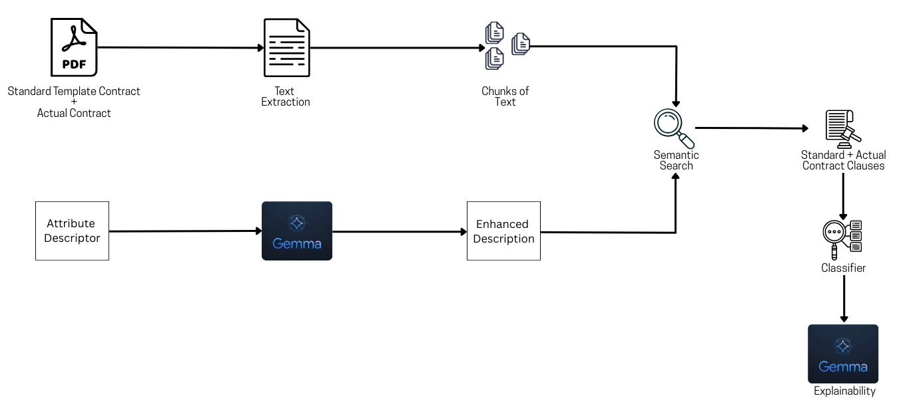
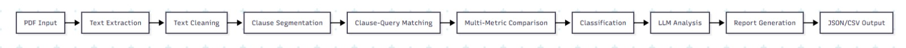
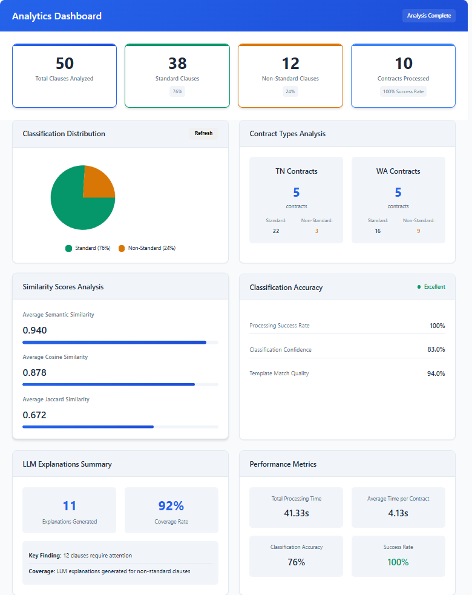
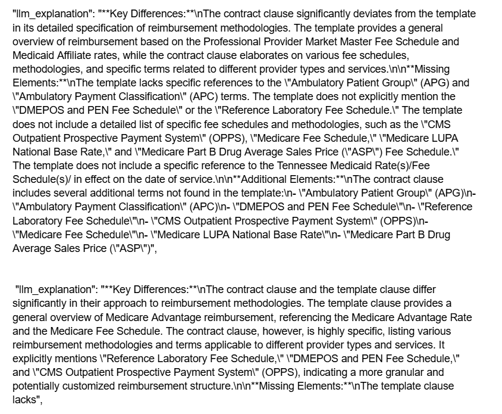

# HiLabs Contract Analysis System

A comprehensive AI-powered system for analyzing contracts, extracting clauses, and comparing them against standard templates using multiple similarity metrics and machine learning techniques.

---

## Table of Contents

- [Overview](#overview)
- [System Architecture](#system-architecture)
- [System Requirements](#system-requirements)
- [Components](#components)
  - [PDF Parsing](#pdf-parsing)
  - [Clause Extraction](#clause-extraction)
  - [Similarity & Classification](#similarity--classification)
  - [LLM Integration](#llm-integration)
  - [Orchestration](#orchestration)
  - [Frontend Dashboard](#frontend-dashboard)
- [Data Pipeline](#data-pipeline)
- [Installation](#installation)
- [Usage](#usage)
- [Output Format](#output-format)

---

## Overview

The HiLabs Contract Analysis System automates the process of reviewing legal contracts by:

- Extracting text and tables from PDF documents (including scanned PDFs via OCR)
- Identifying and segmenting contract clauses using NLP techniques
- Comparing clauses against standard templates using multiple similarity metrics
- Classifying clauses as standard or non-standard based on configurable thresholds
- Generating human-readable explanations using large language models
- Providing a web-based dashboard for real-time analysis monitoring
- [Demo Video](https://drive.google.com/drive/folders/1x735e-qB64rEwGpVI0FxgjME57tdKnUO?usp=sharing)
---

## System Architecture

The system follows a modular pipeline architecture with the following flow:




---

## System Requirements

### Hardware Requirements

| Component   | Minimum Specification               |
| ----------- | ----------------------------------- |
| *RAM*     | 16GB                                |
| *GPU*     | 4GB VRAM (for GPU acceleration)     |
| *Storage* | Adequate space for PDFs and outputs |

### Software Requirements

- *Python*: 3.12.7
- *Operating System*: Windows, Linux, or macOS
- *Tesseract OCR*: Required for OCR functionality
- *Cuda*: Cuda Toolkit 12.1
- The template PDFs are expected to be in the directory named "Standard Templates" and the contract PDFs are expected to be in the directory named "Contracts" with their respective subdirectories.

### Performance Notes

> *⚠ CRITICAL*: Ensure no other resource-intensive applications are running during analysis to prevent memory issues and ensure optimal performance.

- GPU acceleration is mandatory for faster semantic similarity computations
- Close unnecessary applications before starting analysis
- Large PDF files may require additional processing time

---

## Components

### PDF Parsing

*Module*: pdf_parser.py  
*Class*: RobustPDFParser

Handles PDF document processing with multiple extraction strategies:

#### Features

- *Text Extraction*: Direct text parsing using docling
- *OCR Fallback*: Automatic OCR via pytesseract for scanned PDFs
- *Table Detection*: Extracts tabular data using camelot-py
- *Text Cleaning*: Normalizes whitespace, removes artifacts, handles multi-column layouts

#### Key Methods

```python
def parse(self, filepath: Path) -> List[str]
    """Returns a list of cleaned text strings, one per page."""

def extract_tables(self, filepath: Path) -> List[pd.DataFrame]
    """Returns DataFrame list representing each extracted table."""
```

---

### Clause Extraction

*Module*: clause_extractor.py  
*Class*: ContractClauseExtractor

Identifies and extracts individual clauses from parsed contract text.

#### Features

- *Query Loading*: Imports predefined contract queries (payment, termination, etc.)
- *Clause Segmentation*: Splits text using regex patterns and NLP tokenization
- *Similarity Search*: Compares clauses against query templates using:
  - *TF-IDF*: Vectorization with configurable n-grams
  - *Semantic Embeddings*: Contextual similarity via sentence-transformers/all-mpnet-base-v2

#### Key Methods

```python
def extract_clauses(self, pages: List[str]) -> List[str]
    """Returns a list of clause text segments."""

def search_clauses(self, clauses: List[str], queries: List[str]) -> List[Dict]
    """Outputs matched clauses with scores and metadata."""
```

---

### Similarity & Classification

*Module*: contract_classification.py  
*Class*: ContractClauseClassifier

Performs multi-metric similarity analysis and classification.

#### Similarity Metrics

The system calculates seven different similarity metrics:

1. *Cosine Similarity* - TF-IDF and word vector comparison
2. *Jaccard Index* - Token set overlap
3. *Levenshtein Distance* - Character-level edit distance
4. *Jaro-Winkler* - Character similarity with prefix weighting
5. *Dice Coefficient* - Token overlap measure
6. *Bigram Metrics* - Bigram-based Jaccard and Dice
7. *Semantic Similarity* - Contextual embeddings via transformer models

#### Features

- *Weighted Aggregation*: Normalizes and combines multiple metrics
- *Configurable Thresholds*: Adjustable classification boundaries
- *Summary Statistics*: Provides aggregate metrics and confidence distributions

#### Key Methods

```python
def compare_clauses(self, contract_clause: str, template_clause: str, ...) -> ClauseComparisonResult
    """Compares two clauses using multiple similarity metrics."""

def get_classification_summary(self, results: List[ClauseComparisonResult]) -> Dict
    """Generates aggregate statistics for a set of comparisons."""
```

---

### LLM Integration

*Module*: llm_query_generator.py  
*Class*: ContractQueryGenerator

Generates human-readable explanations for non-standard clauses.

#### Features

- *Prompt Construction*: Formats extracted clauses into LLM-friendly prompts
- *Local Inference*: Uses Llama.cpp google/gemma-3n-E2B-it for privacy-preserving analysis
- *Query Expansion*: Generates natural language explanations

#### Key Methods

```python
def generate_queries(self, clauses: List[str]) -> Dict[str, str]
    """Generates explanatory queries for a list of clauses."""
```

---

### Orchestration

*Module*: main_orchestrator.py  
*Class*: ContractOrchestrator

Coordinates the entire analysis pipeline.

#### Responsibilities

1. *Component Initialization*: Instantiates all processing modules
2. *File Discovery*: Recursively scans contract and template directories
3. *Template Processing*: Processes and caches standard templates
4. *Contract Processing*: Executes full analysis pipeline for each contract
5. *LLM Enhancement*: Generates descriptions using language models
6. *Reporting*: Serializes outputs to JSON and CSV formats

#### Execution Flow

python
orchestrator = ContractOrchestrator(
    enable_ocr=True,
    semantic_weight=0.85,
    tfidf_weight=0.15
)
results = orchestrator.run_complete_analysis()


---

### Frontend Dashboard

*Module*: app.py  
*Framework*: Flask with Server-Sent Events (SSE)

Provides a web-based interface for monitoring analysis in real-time.

#### Routes

| Route             | Method | Description                      |
| ----------------- | ------ | -------------------------------- |
| /               | GET    | Renders main dashboard           |
| /start_analysis | POST   | Launches background analysis     |
| /stop_analysis  | POST   | Terminates running process       |
| /status         | GET    | Returns JSON status and progress |
| /stream         | GET    | Streams live log events (SSE)    |

#### UI Features

- *Control Panel*: Start/Stop controls with status indicators
- *Progress Bar*: Real-time progress visualization (0-100%) with stage markers
- *Live Output*: Color-coded log stream with timestamps
- *Results Section*: Collapsible panels showing:
  - Summary statistics
  - Contract details
  - Classification metrics
  - Output file paths

---

## Data Pipeline

The system processes contracts through the following stages:



### Stage Details

1. *PDF Loading* - RobustPDFParser.parse()
2. *Text Cleaning* - Normalization & OCR fallback
3. *Clause Chunking* - ContractClauseExtractor.extract_clauses()
4. *Clause-Query Matching* - search_clauses() (TF-IDF + embeddings)
5. *Classification* - compare_clauses() (multi-metric + threshold)
6. *Query Generation* - ContractQueryGenerator.generate_queries()
7. *Report Serialization* - JSON/CSV via CustomJSONEncoder
8. *Frontend Streaming* - SSE via Flask

---
## Output Format

### Dashboard



### LLM Explaination Outputs



---

## Installation

### Prerequisites

```bash
# Install system dependencies (Ubuntu/Debian)
sudo apt-get update
sudo apt-get install tesseract-ocr python3-tk

# Install system dependencies (macOS)
brew install tesseract
```

### Python Dependencies

```bash
# Clone the repository
git clone https://github.com/Abhijit89Kumar/DATAMAVERICKS_IITKGP.git

# Create virtual environment
python -m venv venv
source venv/bin/activate  # On Windows: venv\Scripts\activate

# Install requirements
pip install -r requirements.txt
```

### Required Python Packages

- docling - PDF text extraction
- pytesseract - OCR functionality
- camelot-py - Table extraction
- sentence-transformers - Semantic embeddings
- scikit-learn - TF-IDF and similarity metrics
- pandas - Data manipulation
- numpy - Numerical operations
- Flask - Web dashboard
- llama-cpp-python - Local LLM inference

---

## Configuration

### Environment Variables

Create a .env file in the project root:
.env
HF_TOKEN


---

## Usage

### Command-Line Batch Processing

Process all contracts in the configured directory:

```bash
python main_orchestrator.py
```

### Web Dashboard

Launch the interactive dashboard:

```bash
python app.py
```

Then navigate to http://localhost:5000 in your browser.


## Troubleshooting

### Common Issues

*Memory Errors*

- Close unnecessary applications
- Reduce batch size
- Enable GPU acceleration

*OCR Not Working*

- Verify Tesseract installation: tesseract --version
- Check OCR language packs: tesseract --list-langs

*Slow Performance*

- Enable GPU acceleration
- Reduce semantic model size
- Adjust batch processing parameters

*Import Errors*

- Verify all dependencies are installed: pip list
- Ensure virtual environment is activated

---

## Acknowledgments

- docling for PDF parsing
- sentence-transformers for semantic embeddings
- scikit-learn for machine learning utilities
- Flask for web framework